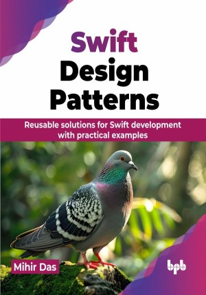

# Swift Design Patterns

Reusable solutions for Swift development with practical examples.

This is the repository for [Swift Design Patterns
](https://bpbonline.com/products/swift-design-patterns?variant=43970122776776),published by BPB Publications.

## About the Book
Swift, Apple's intuitive and feature-rich programming language, has revolutionized the landscape of app development. Its clear syntax and powerful capabilities make it a go-to choice for developers of all levels. Swift Design Patterns' brings an exciting set of design patterns that makes the process of app development simpler, quicker and error-free.

Understand, implement, and run the various design patterns such as architectural patterns, creative patterns, behavioral patterns and structural patterns. The book teaches each of these patterns in detail, explores its coding, architecture, principle components and layers, and how they work together to build robust and efficient Swift applications. While doing so, it also explores the most effective design tools, Figma and Zeplin, and how to use them effectively.

By the end of this book, you will be equipped with the knowledge and skills to design and implement complex Swift applications using proven design patterns. You will be able to write cleaner, more efficient, and reusable code, making you a more proficient Swift developer.

## What You Will Learn
• Implement essential Swift design patterns in your projects.

• Write clean, maintainable code and design scalable apps using SOLID and architectural patterns.

• Reactive programming with RxSwift and testing with XCTest.

• Collaborate effectively with design teams using Zeplin and Figma.

• Enhance app performance with optimized design solutions.
